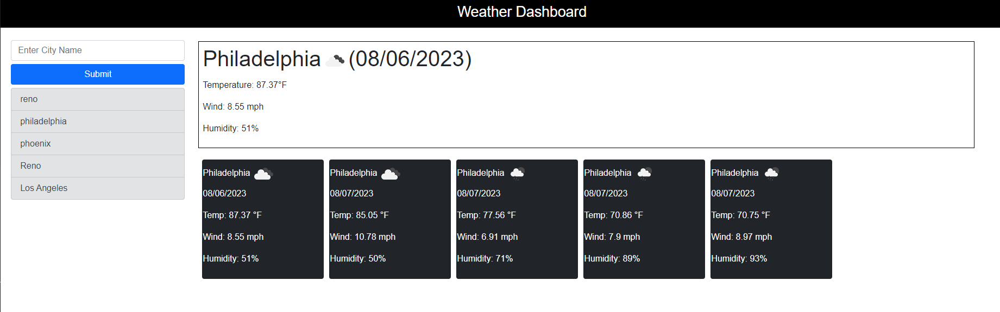

## Weather Dashboard

This is a webpage to search for weather conditions. The user's search will return current conditions in the city and also a 5 day forecast. The search history will be saved in to localstorage. The page uses the openweather and dayjs apis. Bootstrap was used for some portions of formatting of the page.

## Deployed Link

https://cdziedzic.github.io/Weather-dashboard/

## Screenshot

